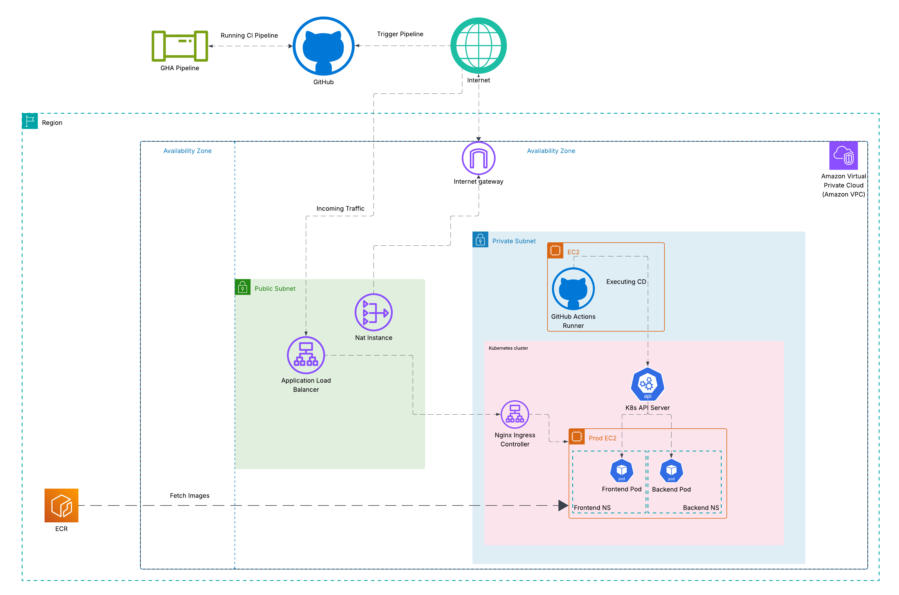
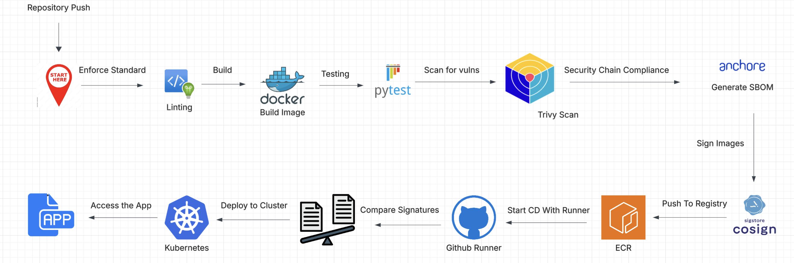

# IAI Home Task

This project delivers a full CI/CD pipeline for deploying cloud-native microservices into a secure, private Kubernetes cluster on AWS. i've put an emphasis on security, saperation of concerns and robustness over more flashy or feature reach app.

---

##  High-Level Architecture

  

- React frontend + Flask backend
- Kubernetes cluster 
- Public ALB → Nginx Ingress → Services → Pods
- GitHub Actions for CI and a self hosted runner for CD
- Container images pushed to ECR according to the reqs
- Images are signed using Sigstore (cosign)

## Components

### **Frontend**
- React SPA served via Nginx 
- Pub access via ALB -> Nginx Ingress -> Pod
- Communicates with the backend cluster-internally

### **Backend**
- Flask API + Gunicorn
- Exposed via ClusterIP service

### **Kubernetes**
- Self-managed kubeadm cluster 
- CNI: Cilium, no eBPF mode (left the default kube-proxy)
- Ingress: Nginx   
- Namespaces saperation for each component

### **AWS**
- VPC with public & private subnets
- Spanning across 2 AZ for ALB usage 
- NAT instance for private egress
- ALB for HTTPS entry
- ECR for container images
- TLS Term occurs at the internet facing ALB

---

##  CI/CD Flow

  

1. main branch push triggers full pipeline
2. **CI (GitHub-hosted runners):**
   - Run tests (Python + Node)
   - Linting (pylint)
   - Build & tag Docker images
   - Trivy security scan
   - Generate SBOM (SPDX)
   - Push images to ECR
   - Sign images with Sigstore (cosign)
3. **CD (self-hosted runner in VPC):**
   - Uses inject kubeconfig for context
   - Refresh ECR registry secret
   - Confirm images digest
   - Apply Kubernetes manifests
   - Verify rollout success

---

##  Security Highlights

- No private keys stored or managed anywhere — Cosign uses keyless signing
- Roles and policies are following the least privileged concept
- Fresh ECR credentials generated every deploy (tokens expire after 12h)
- Vulnerability + secret scanning before images reach production
- SBOM provides full dependency visibility

---
## The app

The app is accessible on: https://iai.yinonlevy.online

